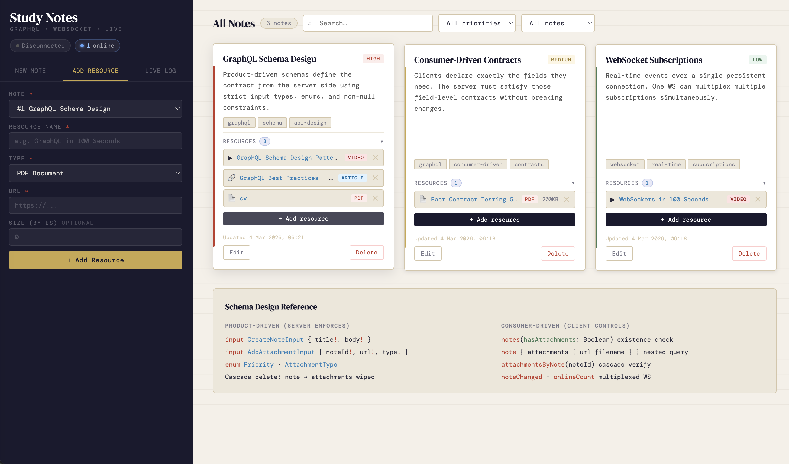

# Notes — GraphQL + WebSocket

A minimal full-stack app with one entity (Note), full CRUD, and real-time subscriptions over WebSocket.

## Stack
- **Backend**: Node.js + `graphql-yoga` + `graphql-ws` + `ws`
- **Frontend**: Vanilla HTML/CSS/JS (no build step)
- **Protocol**: `graphql-transport-ws` over WebSocket

## Setup

```bash
npm install
npm start
```

### Serve the frontend on port 5173

You can serve `index.html` using Python's built-in HTTP server:

```bash
python3 -m http.server 5173
```

Then open [http://localhost:5173](http://localhost:5173) in your browser to view the app.

## API

**Endpoint**: `http://localhost:4000/graphql`
**WebSocket**: `ws://localhost:4000/graphql`
**GraphiQL IDE**: http://localhost:4000/graphql

### Schema

```graphql
type Note {
  id: ID!
  title: String!
  body: String!
  createdAt: String!
  updatedAt: String!
}

type NoteEvent {
  action: String!   # CREATED | UPDATED | DELETED
  note: Note!
}

# Queries
notes: [Note!]!
note(id: ID!): Note

# Mutations
createNote(title: String!, body: String!): Note!
updateNote(id: ID!, title: String, body: String): Note!
deleteNote(id: ID!): Note!

# Subscription
noteChanged: NoteEvent!
```

## Test with the playground

Open two browser tabs with `index.html`. Create/edit/delete in one tab and watch the other update live via WebSocket subscription.

You can also test using the GQL+WS Playground HTML file with:
- Endpoint: `http://localhost:4000/graphql`
- WS URL: `ws://localhost:4000/graphql`


## Jira Integration

A CLI script that connects to your Jira Cloud project and fetches board context — project info, active sprints, epics, and issues. This gives us a quick snapshot of the project's current state directly from the terminal, helping track coverage and progress without switching to the browser.

### Setup

1. Copy `.env.example` to `.env` and fill in your Jira credentials:
   ```
   JIRA_BASE_URL=https://yourcompany.atlassian.net
   JIRA_EMAIL=you@company.com
   JIRA_API_TOKEN=your-api-token
   JIRA_PROJECT_KEY=SCRUM
   ```
   Generate an API token at https://id.atlassian.com/manage-profile/security/api-tokens

2. Run the script:
   ```bash
   npm run jira
   ```

### What it fetches
- **Project** — name, lead, description
- **Active & future sprints** — sprint name and dates
- **Epics** — all epics with status
- **Issues** — all issues with type, status, assignee, and priority

### How we use it
- **Track coverage** — see all tickets in the project to ensure nothing is missed
- **Sprint awareness** — quickly check what's in the current sprint and what's coming next
- **Development context** — before starting work, run `npm run jira` to see the full board state and pick up the right tickets